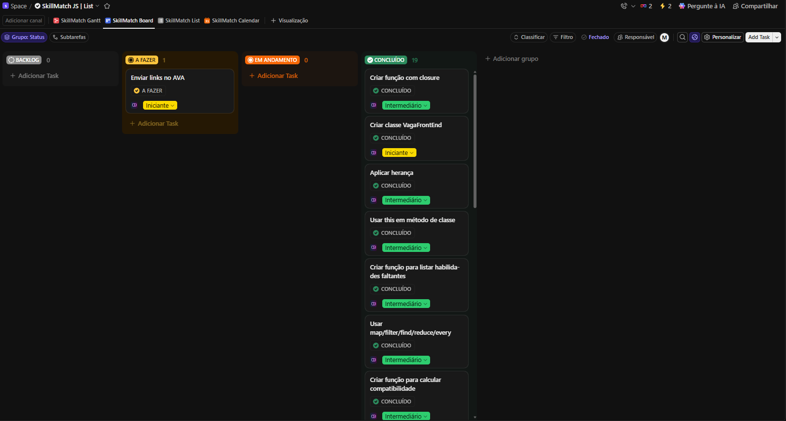
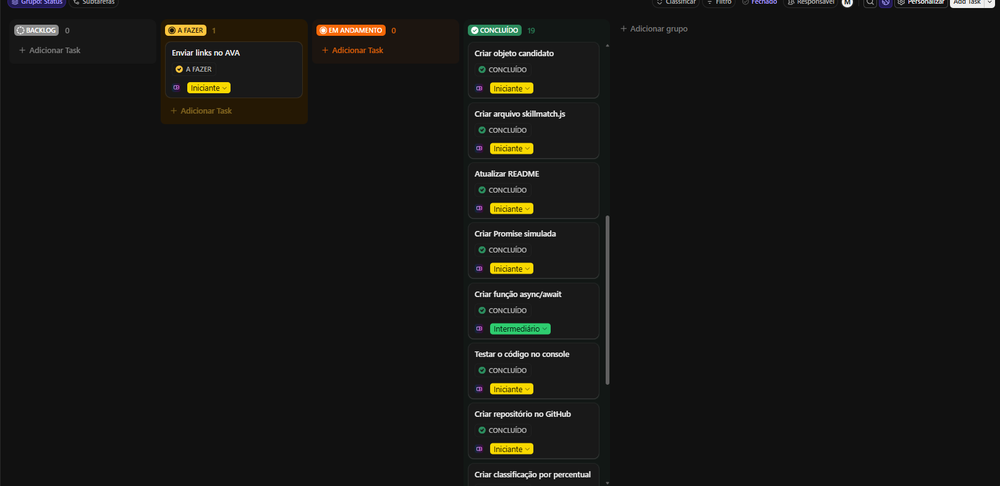
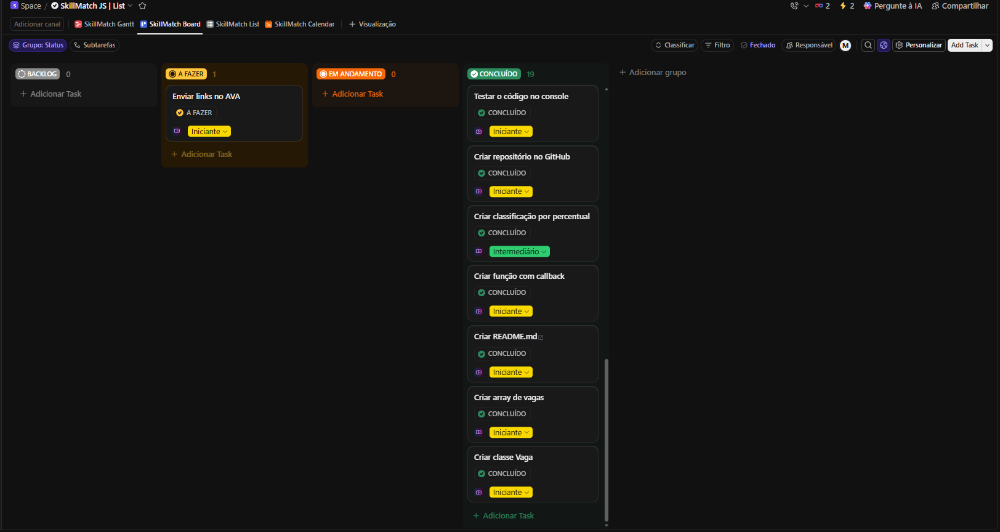

# SkillMatch-JS
<<<<<<< Updated upstream
Um projeto de um simulador simples de compatibilidade entre um perfil de candidato e vagas de front-end júnior, visando ser o mais próximo de uma situação real: analisar requisitos de vagas, comparar habilidades, calcular aderência e identificar pontos de melhoria.
=======

## Sobre o projeto

Um projeto de um simulador simples de compatibilidade entre um perfil de candidato e vagas de de programação, visando ser o mais próximo de uma situação real: analisar requisitos de vagas, comparar habilidades, calcular aderência e identificar pontos de melhoria.

O SkillMatch-JS compara as habilidades do candidato com os requisitos das vagas e mostra:

- percentual de compatibilidade;
- habilidades encontradas;
- habilidades faltantes;
- vaga mais compatível;
- recomendação de estudo.

## ⚠️ Antes de executar

Para obter um resultado mais preciso e personalizado, edite o objeto `candidato` 
no início do arquivo `skillmatch.js` com suas informações reais. 
Por favor, evite inserir informações falsas.

## Como executar

1. Abra o navegador de sua preferência
2. Pressione `F12` ou `Ctrl + Shift + J` para abrir as ferramentas do desenvolvedor
3. Clique na aba **Console**
4. Copie todo o código do arquivo `skillmatch.js`
5. Cole no console
6. Pressione **Enter**

## Aprendizagem

Conceitos que foram aprendidos e aplicados no projeto:

- **Filter e Map** — usei para filtrar ou mapear alguns dados de arrays ou classes
- **Classes** — criei a classe gerais de variáveis
- **Promise e async/await** — usei para simular um tempo resposta de um servidor
- **Callback** — criei uma função que recebe outra função como parâmetro e a executa ao final da análise
- **Closure** — criei um contador que mantém o valor interno entre as chamadas para contar as análises realizadas
- **GitHub** - utilizei para poder publicar na internet
- **ClickUp Kanban** - utilizei para a organização das etapas do projeto

## Quadro Kanban

## Links

**[ClickUp Kanban]** - https://sharing.clickup.com/90171247352/b/6-901713861386-2/skill-match-board (devido a erros recorrente a planos de assinaturas, no link não será possível vizualizar os tópicos "BACKLOG" e "EM ANDAMENTO", mas é possível vizualizar via as fotos a cima)
**[GitHub]** - https://github.com/fleche12rsk/SkillMatch-JS/tree/main (link do repositório do projeto no GitHub)
**[Link vídeo]** - https://drive.google.com/file/d/1PE_F1JjY5K3Om7g3WU5ZJ6YXGw2cx1VU/view?usp=sharing (link do vídeo explicando melhor sobre o projeto)
>>>>>>> Stashed changes
